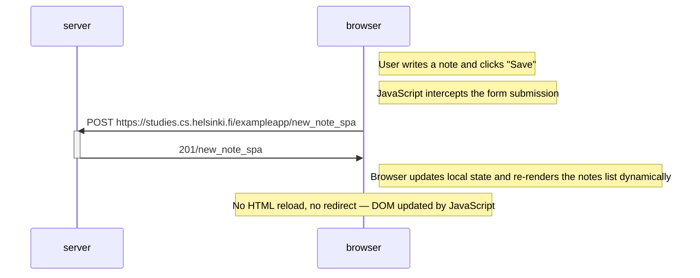

```mermaid

sequenceDiagram
    participant server
    participant browser

    Note right of browser: User writes a note and clicks "Save"

    Note right of browser: JavaScript intercepts the form submission

    browser->>server: POST https://studies.cs.helsinki.fi/exampleapp/new_note_spa
    activate server
    server->> browser: 201/new_note_spa
    deactivate server

    Note right of browser: Browser updates local state and re-renders the notes list dynamically

    Note over browser: No HTML reload, no redirect — DOM updated by JavaScript

```